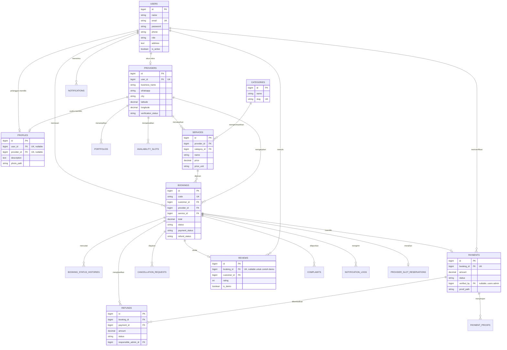

# ERD Andallo

Autentikasi memakai satu tabel `users` dengan kolom `role` (`customer`, `provider`, `admin`). Ini memetakan entitas Admin, Pengguna, dan Penyedia Jasa pada ERD tanpa sistem login kedua. Nama, email, kata sandi, telepon, dan alamat akun ada di `users`. Profil usaha ada di `providers`.

Kardinalitas yang diterapkan:

- Pengguna pelanggan ke profil: satu ke satu lewat `profiles.user_id`.
- Penyedia ke profil: satu ke satu lewat `profiles.provider_id`.
- Tepat satu pemilik profil diisi. Di MySQL ini dijaga constraint `profiles_one_owner`, di aplikasi dijaga saat menyimpan model.
- Penyedia ke jasa: satu ke banyak.
- Kategori ke jasa: satu ke banyak.
- Pelanggan ke pemesanan: satu ke banyak.
- Jasa ke pemesanan: satu ke banyak.
- Pemesanan ke pembayaran: satu ke satu. Pembayaran dibuat saat penyedia menerima.
- Admin ke pembayaran: satu ke banyak lewat `payments.verified_by`.
- Pemesanan selesai ke ulasan pelanggan: satu ke satu.
- Riwayat transaksi tidak dihapus lewat cascade. Akun dan jasa yang sudah bertransaksi dinonaktifkan atau soft delete.
